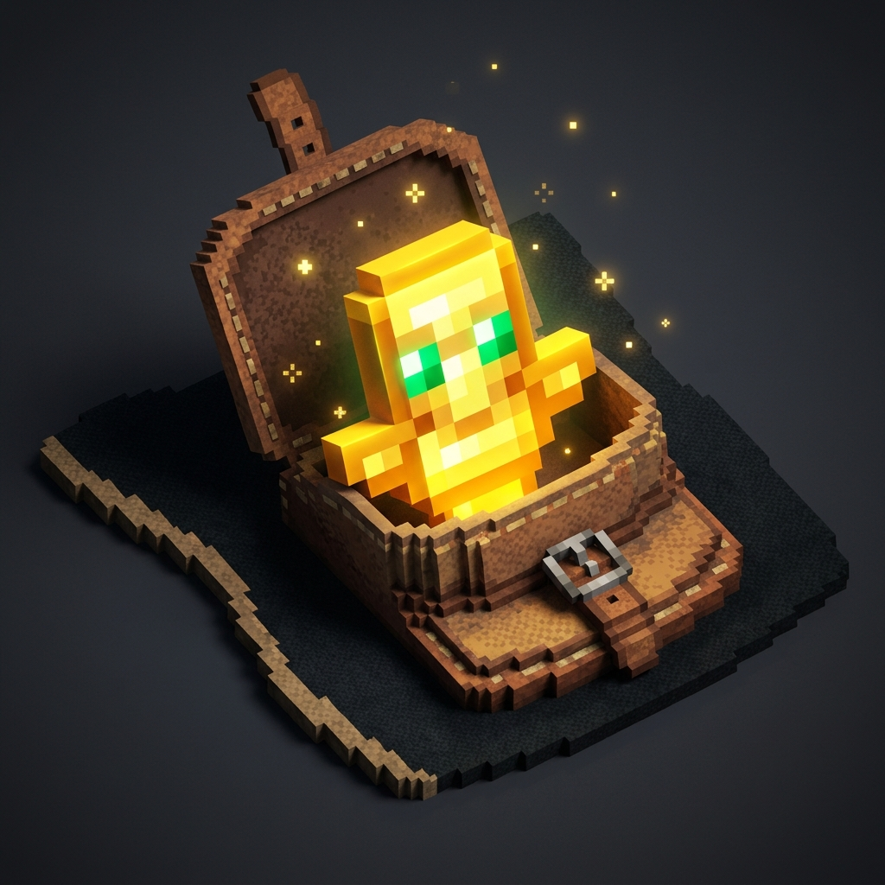

# Fair Totem ⚡

**Fair Totem** lets the Totem of Undying save you from death even when it's stored anywhere in your inventory — no more wasting an offhand slot!

From the creator of [Bigger Ender Chest](https://modrinth.com/mod/bigger-ender-chest) and [Bigger Shulker Boxes](https://modrinth.com/mod/bigger-shulker-boxes).

---

## ✨ Features

- **Inventory-Wide Protection**: The Totem of Undying now activates from any inventory slot, not just your hands.
- **Hand Priority**: If you're already holding a totem in your main or offhand, vanilla behavior is preserved — no duplication.
- **Full Vanilla Effects**: Regeneration, Absorption, Fire Resistance, and the totem animation all trigger normally.
- **Server Compatible**: Works on both client and server side seamlessly.
- **Zero Config**: Install and forget. No settings, no bloat.

---

## 🛠️ Installation

1. Install [Fabric Loader](https://fabricmc.net/use/installer/) for Minecraft Java Edition.
2. Download **Fair Totem** `.jar` from [Modrinth](https://modrinth.com/mod/fair-totem) or [GitHub Releases](https://github.com/antaripnandi/fair-totem/releases).
3. Place the `.jar` file into your `.minecraft/mods` folder.
4. Launch the game — your Totem now works from anywhere in your inventory!

---

## 📄 License

Available under the [MIT License](LICENSE).
